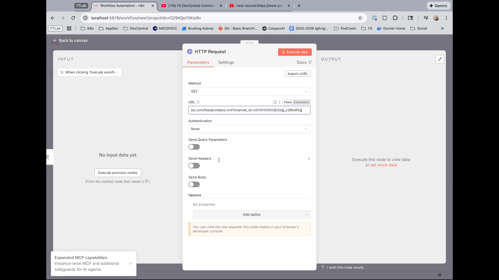
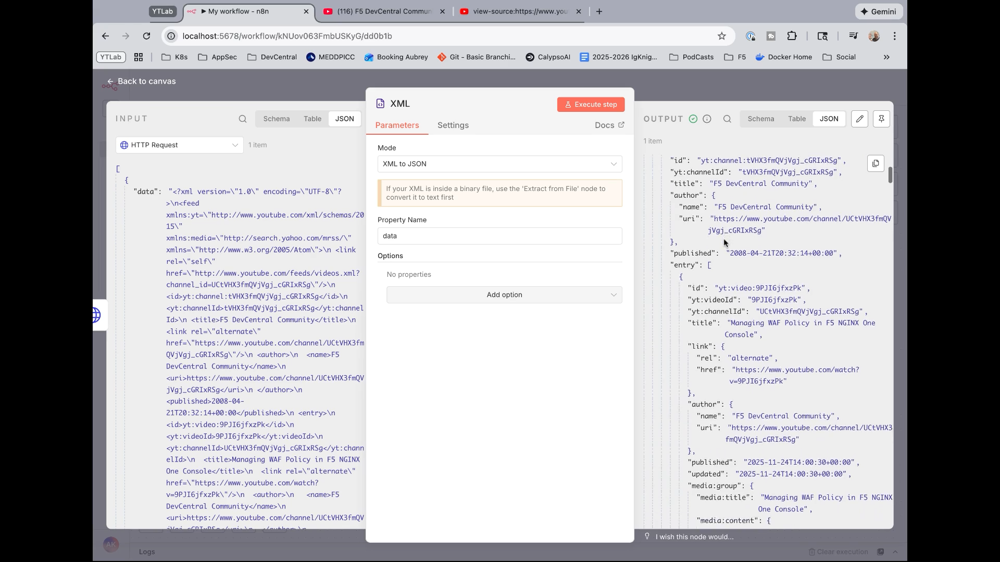
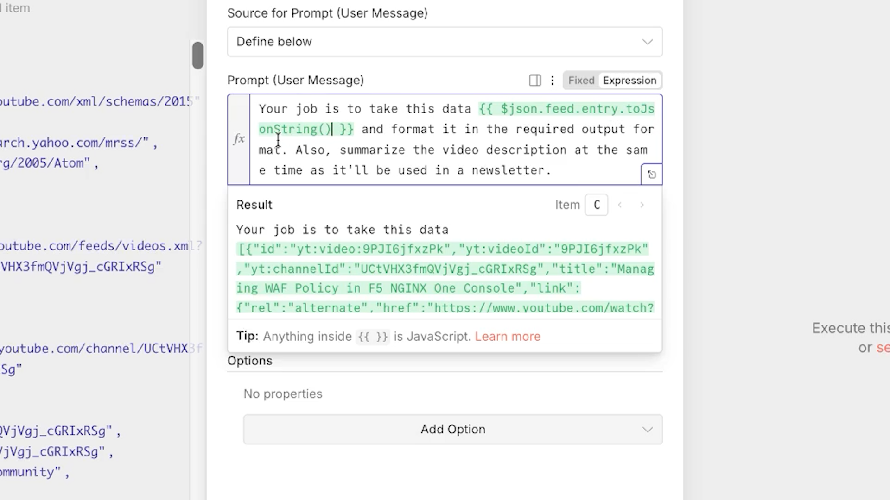
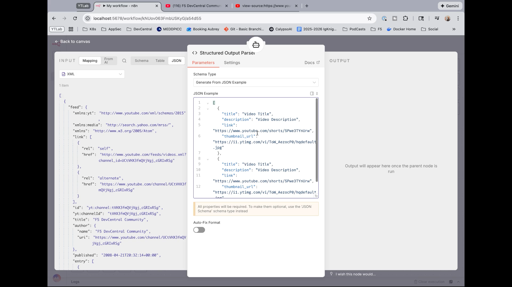
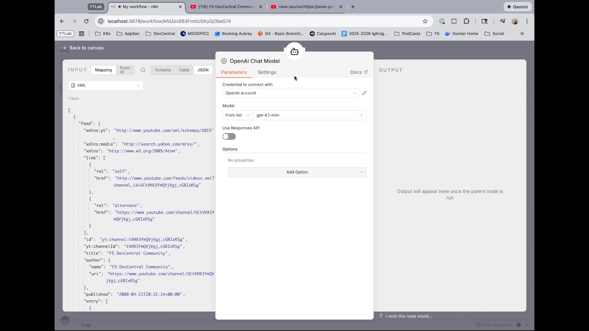
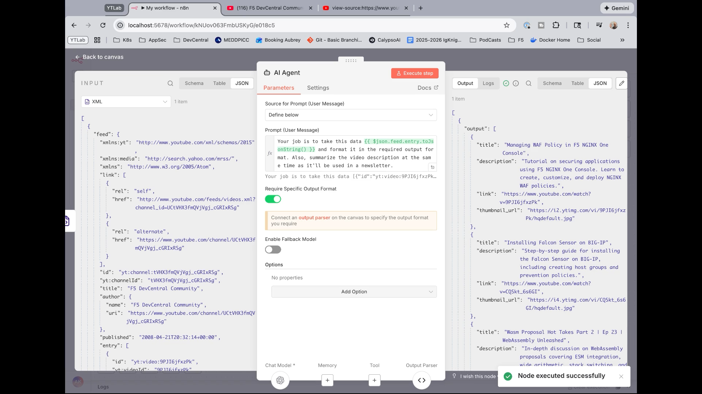
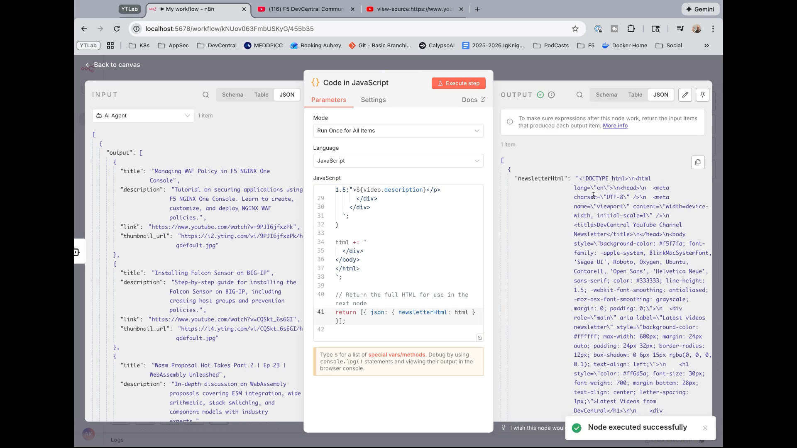
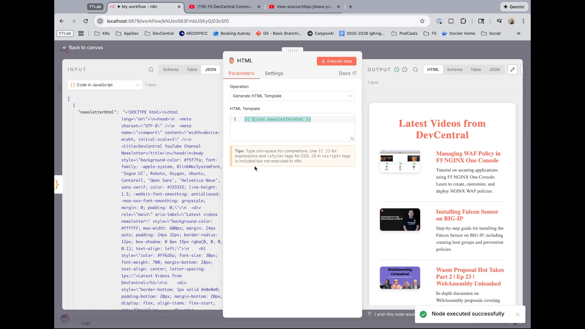
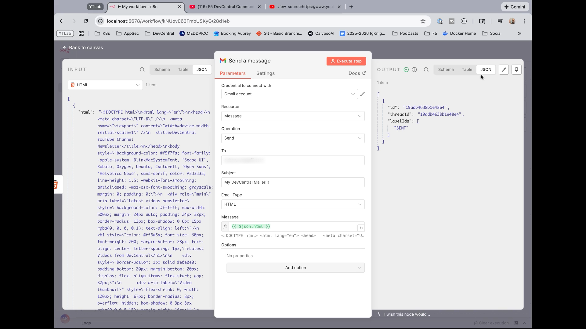

# n8n YouTube RSS to HTML Newsletter Lab

## Goals

By the end of this lab, you will have built a workflow that:

- Fetches a YouTube channel’s RSS feed
- Converts the XML to JSON
- Uses an AI agent to extract and summarize key details (title, description, link, thumbnail)
- Generates an HTML newsletter from the results
- Emails the newsletter using Gmail

Architecture note: This workflow runs entirely on your n8n instance and uses OpenAI’s API for summarization. No local LLM setup is required.

## Prerequisites

1. n8n installed and reachable in your browser
2. Gmail account with OAuth credentials configured in n8n
    - Follow n8n’s Gmail OAuth docs to create credentials in Google Cloud Console and connect them in n8n
3. OpenAI account and API key
    - Create/verify your key in OpenAI’s portal; add it to n8n as OpenAI credentials
4. The Channel ID of the YouTube channel you want to monitor

Tip: The RSS URL format for a YouTube channel is:
<https://www.youtube.com/feeds/videos.xml?channel_id=CHANNEL_ID>

### How to find a YouTube Channel ID (one simple way)

- Open the channel page in your browser
- Right-click and select “View Source” (or press Ctrl/Cmd+U)
- Search for “RSS” or “channel_id”
- Copy the value after `channel_id=` and use it in the RSS URL above

    ---

## Workflow Creation

### Create and trigger the workflow

**Step 1:** Create a new workflow in n8n.
**Step 2:** Choose how to trigger it:
    - For this lab, select “Manual Trigger” (easiest to test)
    - Optional: Add a Schedule Trigger (e.g., weekly) if you want automatic emails

### Fetch the YouTube RSS feed

**Step 3:** Add an “HTTP Request” node.
    - Method: GET
    - URL: <https://www.youtube.com/feeds/videos.xml?channel_id=YOUR_CHANNEL_ID>
    - Execute the node and verify you receive XML (RSS)
    

### Convert XML to JSON

**Step 4:** Add an “XML” node directly after the HTTP Request.
    - Operation: XML to JSON
    - Execute the node
    - Inspect the output; you should see a `feed` object with an `entry` array containing videos and metadata (titles, descriptions, thumbnails, links)
    

### Transform and summarize with an AI Agent

**Step 5:** Add an “AI Agent” node after the XML node.
**Step 6:** Configure the prompt:
    - In the AI Agent’s prompt text, include a clear instruction and pass the `entry` array as context. For example:

    Your job is to take this data {{ $json.feed.entry.toJsonString() }} and format it in the required output format. Also, summarize the video description at the same time as it'll be used in a newsletter.
    

**Step 7** Require a structured output:
    - Add/enable a “Structured Output Parser” in the AI Agent
    - JSON Example (paste this as the schema/example):
        ```
[
            {
                "title": "Video Title",
                "description": "Video Description",
                "link": "https://www.youtube.com/shorts/5Pwe3TYnUrw",
                "thumbnail_url": "https://i1.ytimg.com/vi/ToW_AezocP0/hqdefault.jpg"
            },
            {
                "title": "Video Title",
                "description": "Video Description",
                "link": "https://www.youtube.com/shorts/5Pwe3TYnUrw",
                "thumbnail_url": "https://i1.ytimg.com/vi/ToW_AezocP0/hqdefault.jpg"
            }
]
        ```
    
**Step 8:** Attach the chat model:
    - Provider: OpenAI
    - Credentials: your OpenAI API key (create credentials in n8n if needed)
    - Model: gpt-4.1-mini (low cost, fast, sufficient for this task)
    
**Step 9:** Execute the AI Agent node.
    - Verify the output is a clean JSON object with a `videos` array containing your simplified objects (title, description, link, thumbnail_url)
    

### Generate the HTML newsletter

**Step 10:** Add a “Code” node (JavaScript) after the AI Agent.
**Step 11:** Paste the following code to build your HTML from the AI output:

        const videos = $input.first().json.output;

        let html = `<!DOCTYPE html>
        <html lang="en">
        <head>
            <meta charset="UTF-8" />
            <meta name="viewport" content="width=device-width, initial-scale=1" />
            <title>DevCentral YouTube Channel Newsletter</title>
        </head>
        <body style="background-color: #f5f7fa; font-family: -apple-system, BlinkMacSystemFont, 'Segoe UI', Roboto, Oxygen, Ubuntu, Cantarell, 'Open Sans', 'Helvetica Neue', sans-serif; color: #333333; line-height: 1.5; -webkit-font-smoothing: antialiased; -moz-osx-font-smoothing: grayscale; margin: 0; padding: 0;">
            <div role="main" aria-label="Latest videos newsletter" style="background-color: #ffffff; max-width: 600px; margin: 24px auto; padding: 24px 32px; border-radius: 12px; box-shadow: 0 6px 15px rgba(0, 0, 0, 0.1); text-align: left;">
                <h1 style="color: #ff6d5a; font-size: 30px; font-weight: 700; margin-bottom: 28px; text-align: center; letter-spacing: 1px;">Latest Videos from DevCentral</h1>
        `;

        for (const video of videos) {
            const thumbnail = video.thumbnail_url || '';
            html += `
                <div style="border-bottom: 1px solid #e0e0e0; padding-bottom: 20px; margin-bottom: 20px; display: flex; align-items: flex-start; gap: 32px;">
                    <div aria-label="Video thumbnail" style="flex-shrink: 0; width: 120px; height: 67px; border-radius: 8px; overflow: hidden; box-shadow: 0 3px 8px rgba(0,0,0,0.15); margin-right: 16px;">
                        <a href="${video.link}" target="_blank" rel="noopener noreferrer">
                            
                        </a>
                    </div>
                    <div style="flex-grow: 1;">
                        <p style="font-size: 18px; font-weight: 600; margin: 0 0 8px 0; color: #222222;">
                            <a href="${video.link}" target="_blank" rel="noopener noreferrer" style="color: #ff6d5a; text-decoration: none;" tabindex="0">${video.title}</a>
                        </p>
                        <p style="font-size: 14px; color: #555555; margin: 0; line-height: 1.5;">${video.description}</p>
                    </div>
                </div>
            `;
        }

        html += `
            </div>
        </body>
        </html>
        `;

        // Return the full HTML for use in the next node
        return [{ json: { newsletterHtml: html } }];
**Step 12:** Execute the Code node.
        - Confirm it returns a single newsletter item containing your newsletter HTML
    

### Preview the HTML newsletter

**Step 13:** Add an “HTML” node after the Code node.
    - Operation: Generate HTML (or render from a string/template)
    - Template/Content: drag the `html` field from the Code node into the HTML node’s template input
    - Execute the HTML node to preview the rendered result inside n8n (the preview window is small, but you should see the content structure)
    

### Send the newsletter email via Gmail

**Step 14:** Add a “Gmail” node after the HTML node.
    - Resource: Message
    - Operation: Send
    - Credentials: Select your Gmail OAuth credentials
    - To: your mailing list address (e.g., <newsletter@yourdomain.com>) or your own email for testing
    - Subject: e.g., “DevCentral YouTube Channel Newsletter”
    - Email Type: HTML
    - Message Body: drag the HTML output from the HTML node (e.g., the field containing rendered HTML) into the message body
**Step 15:** Execute the Gmail node.
    - Check the node output for a “sent” status
    - Verify the email arrives in your inbox; if it lands in spam initially, mark it as not spam
    

    ---

## Optional Enhancements

- Replace the Manual Trigger with a Schedule Trigger to send weekly summaries
- Limit the number of videos (e.g., top 10) by slicing the `entry` array before passing it to the AI Agent, or instruct the agent to cap results
- Add logic to only include videos published since the last run (store last published time in a data store and filter)
- Include a plain-text alternative for email clients that block HTML
- Send to Slack or Teams instead of (or in addition to) email

    ---

## Troubleshooting

- HTTP Request returns no data

  - Confirm the Channel ID is correct and the RSS URL format is: <https://www.youtube.com/feeds/videos.xml?channel_id=CHANNEL_ID>

- XML parsing issues
  - Ensure the XML node is set to “XML to JSON”
  - Verify the `entry` array exists under `feed`
- AI Agent output shape differs
  - Double-check the prompt and the structured output schema; require the agent to return exactly the `videos` array
- Gmail OAuth errors
  - Revisit n8n’s Gmail OAuth setup docs; verify OAuth consent screen and scopes
  - Ensure you’ve connected the credentials and allowed n8n access
- Emails going to spam
  - Add proper subject lines, reduce external links, and use consistent sender
  - Warm up sending and consider DKIM/SPF if sending from a custom domain

    ---

## Cost and Performance Notes

- OpenAI usage for this workflow is minimal; a small model like gpt-4.1-mini typically costs pennies per run
- Gmail sending is free for typical use with personal accounts (subject to provider limits)

    ---

## Summary

You now have a working n8n workflow that:

- Monitors a YouTube channel via RSS
- Converts XML to JSON and uses an AI Agent to produce a clean, summarized data set
- Generates an HTML newsletter
- Emails the result via Gmail

Use it to track competitor channels, share highlights internally, or automate your own channel updates.
